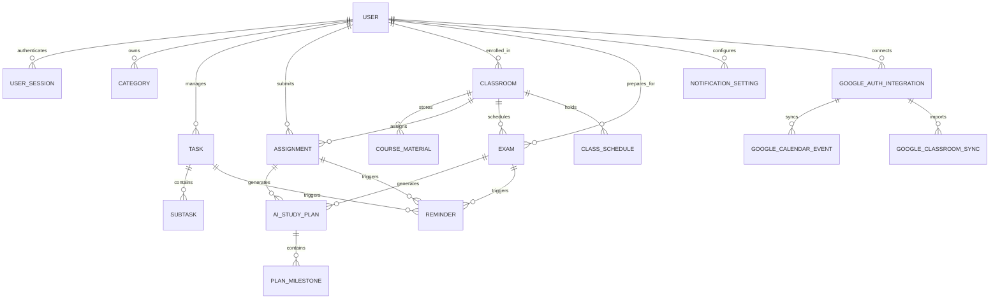

# Product Requirements Document (PRD)
## Personal & Academic Management System (EduFlow / Nexus)

---

### 1. Executive Summary & Overview
The **Personal & Academic Management System** is a unified, all-in-one productivity and academic hub designed for students, educators, and lifelong learners. The platform consolidates daily tasks, academic assignments, live classroom links, course materials, interactive calendar scheduling, and analytics into a cohesive, responsive, and visually aesthetic application.

**Primary Goal:** Minimize cognitive overload by providing a streamlined daily workflow that enables users to track upcoming deadlines, join live classes in one click, monitor personal/academic goals, and stay organized across mobile, tablet, and desktop devices.

---

### 2. Target Audience & Personas

| Persona | Role | Primary Needs | Key Pain Points |
| :--- | :--- | :--- | :--- |
| **Alex (University Student)** | Undergraduate / Graduate | Track assignments across 5+ courses, join Zoom/Meet lectures quickly, manage exam deadlines | Missing assignment submission dates, disorganized lecture links across WhatsApp/emails |
| **Jordan (Bootcamp / Self-Learner)** | Online Cohort Learner | Balance daily coding tasks, project milestones, video lectures, and personal habits | Context switching between multiple disconnected productivity apps |
| **Sam (High School / Prep Student)** | Secondary Education | Visual daily progress motivation, clear priority indicators, dark mode study sessions | Procrastination, feeling overwhelmed by unstructured schedules |

---

### 3. Core Product Features & Functional Requirements

#### 3.1 Central Home Dashboard (Daily Summary)
- **Description:** A clean, high-impact command center showing daily essentials at a glance.
- **Key Capabilities:**
  - **Greeting & Daily Snapshot:** Displays current date, day, dynamic greeting, and motivational daily quote/status.
  - **Today's Agenda & Urgent Items:** Aggregated view of tasks and assignments due in the next 24 hours.
  - **Active & Upcoming Classroom Direct Links:** Cards for scheduled lectures/meetings with "Join Now" countdown badges and direct meeting links (Zoom, Google Meet, Teams).
  - **Quick Stats Bar:** Summary of completed vs. pending tasks for today with an instant progress meter.

#### 3.2 2-Click Quick-Add Task System
- **Description:** Ultra-fast task capture modal/inline widget accessible from anywhere in the app.
- **Key Capabilities:**
  - **Floating Action Button (FAB) & Shortcut:** Universal `+` button and keyboard shortcut (`Ctrl/Cmd + K` or `N`).
  - **Frictionless Entry:** Default input field auto-focused; natural language date recognition (e.g., "Tomorrow at 5pm", "Next Monday").
  - **Instant Tagging:** One-click assignment to category/tag and priority (High, Medium, Low).
  - **Under 2 Clicks to Save:** Enter title -> Click Save (or hit `Enter`).

#### 3.3 Advanced Assignment Tracker & Priority Matrix
- **Description:** Dedicated assignment management dashboard with urgency categorization and visual deadline cues.
- **Key Capabilities:**
  - **Priority Badges:** High (Red/Crimson), Medium (Amber/Orange), Low (Emerald/Green).
  - **Color-Coded Deadline Alerts:**
    - *Overdue / Due Today:* Pulsing Red / Urgent Alert.
    - *Due in 48 Hours:* Amber / Warning.
    - *Upcoming (> 3 Days):* Muted Cool Grey / Blue.
  - **Multi-View Formats:** Toggle between Kanban Board (To-Do, In Progress, Submitted, Graded) and Sortable Data Table/List View.
  - **Submission Checklist & File Notes:** Attach course reference links, file attachments, and submission guidelines.

#### 3.4 Interactive Calendar & Bidirectional Google Calendar Sync Engine
- **Description:** Comprehensive calendar view bringing together class schedules, deadlines, and personal milestones with real-time Google Calendar and iCal integration.
- **Key Capabilities:**
  - **View Modes:** Month, Week, Day, and Agenda List views.
  - **Automatic Schedule Merging:** Syncs internal classroom lecture times and assignment due dates automatically into calendar slots.
  - **Google Calendar 2-Way Synchronization:**
    - Direct integration via **Google Calendar API (v3)** (`calendar.events`, `calendar.calendarList`).
    - **Bidirectional Sync:** Creating or rescheduling tasks/assignments in the app updates the corresponding Google Calendar event; updates made on Google Calendar are reflected in the app.
    - **Target Secondary Calendar Creation:** Option to create a dedicated `"EduFlow / Academic"` sub-calendar in user's Google account to prevent cluttering primary calendar.
    - **Event Metadata Mapping:** Maps class times (start/end timestamp), video meeting links (`hangoutLink` / `location`), recurring recurrence rules (`RRULE`), and assignment deadlines.
  - **iCal / WebCal Subscribable Feed:** Exportable `.ics` calendar URL for universal subscription on Apple Calendar, Outlook, and mobile OS calendars.
  - **Filter & Conflict Detection:** Toggle visibility by course/tag with visual conflict detection warnings for overlapping class sessions and deadlines.

#### 3.5 Visual Progress Dashboard & Gamified Analytics
- **Description:** Visual motivation engine offering insights into productivity and completion velocity.
- **Key Capabilities:**
  - **Daily Completion Rings & Progress Bars:** Visual metrics showing percentage of daily and weekly goals accomplished.
  - **Productivity Streaks:** Daily login and task completion streak counter.
  - **Category Breakdown Charts:** Interactive donut/bar charts displaying time and effort distribution (e.g., 40% Computer Science, 30% Math, 30% Personal).
  - **Historical Trends:** Weekly and monthly productivity velocity comparison.

#### 3.6 Dedicated Classrooms, Course Materials Hub & Custom Folders
- **Description:** Digital repository structured per course/subject with native Google Classroom sync, direct student file uploads, and custom folder management.
- **Key Capabilities:**
  - **Direct Student Material Upload & Organization:**
    - Students can directly upload and manage lecture slides, PDFs, notes, syllabus docs, past papers, and web resource links.
    - **Nested Custom Folders:** Create custom folders within each classroom (e.g., "Week 1 - Intro", "Midterm Prep", "Lab Manuals", "Cheat Sheets").
  - **Google Classroom API Integration:**
    - **Course Sync (`courses.list`):** Automatically imports enrolled courses, section names, room numbers, and teacher profiles.
    - **CourseWork & Assignment Ingestion (`courses.courseWork.list`):** Auto-fetches assignments, due dates, maximum points, attached drive materials, and submission statuses (`TURNED_IN`, `NEW`, `RETURNED`).
    - **Material & Drive Assets Sync (`courses.courseWorkMaterials.list`):** Direct linking to Google Drive folders, syllabus docs, and lecture presentations.
  - **Direct Video Meeting Launcher:** 1-click launch for recurring lecture video links (Google Meet, Zoom, MS Teams).
  - **Instructor Contact Directory:** Instructor & TA names, emails, office hours, and consultation links.
  - **Schedule Timeline:** Course timetable with active status indicators (e.g., "Class in session", "Next class in 2 hours").
  - **Sync Controls:** Manual "Sync Now" button, background auto-polling (every 15-30 mins), and webhook push notifications via Cloud Pub/Sub.

#### 3.7 Custom Categories, Folders & Tagging Architecture
- **Description:** Hierarchical organization framework to prevent clutter.
- **Key Capabilities:**
  - **Nested Organization:** Create root Categories (Academic, Projects, Personal, Work) and sub-folders or subjects.
  - **Color & Icon Customization:** Pick from custom color palettes and icons/emojis for quick visual recognition.
  - **Unified Filtering:** Global filter bar allowing search and filtering by Category, Tag, Priority, and Status.

#### 3.8 Intelligent Reminders & Notification Engine
- **Description:** Timely multichannel notifications to eliminate missed deadlines.
- **Key Capabilities:**
  - **24-Hour & 1-Hour Proximity Alerts:** Automatic triggers for tasks and assignments due in 24h and 60m.
  - **Push Notifications:** Web and device native push alerts for browser/mobile users.
  - **Email Digests:** Daily Morning Briefing email (upcoming tasks & classes) and deadline warnings.
  - **Notification Preferences:** Fine-grained toggles to enable/disable sound, email, push, and snooze durations.

#### 3.9 Fully Responsive Multi-Device UI/UX
- **Description:** Seamless, fluid user experience optimized for desktop, tablet, and mobile screens.
- **Key Capabilities:**
  - **Desktop:** Collapsible multi-tier sidebar, multi-column cards, productivity keyboard shortcuts.
  - **Tablet:** Adaptive 2-column layout with swipe gestures.
  - **Mobile:** Bottom navigation bar, thumb-friendly touch targets, modal bottom-sheets for quick actions.

#### 3.10 Theme Engine & Late-Night Dark Mode
- **Description:** Built-in dynamic theme switcher to reduce eye strain.
- **Key Capabilities:**
  - **Themes:** High-contrast Dark Mode (deep slate/charcoal tones, glowing accents), Clean Light Mode, and System Default sync.
  - **Smooth Transitions:** Zero-flicker CSS variable theme switching.
  - **Color Contrast Compliance:** WCAG 2.1 AA compliant contrast ratios for readability.

#### 3.11 User Authentication, Signup/Login & Multi-Tenant Data Security
- **Description:** Secure, isolated user access management ensuring every user's tasks, course materials, grades, and calendar entries remain strictly confidential, private, and impenetrable by other users.
- **Key Capabilities:**
  - **Authentication Workflows:**
    - **Email & Password Registration / Login:** Client-side & server-side validation, password strength meter, email confirmation support, and password reset flows.
    - **Google OAuth 2.0 Single Sign-On (SSO):** Fast 1-click login and registration via Google Identity Services, seamlessly pre-authorizing Google Classroom & Calendar sync scopes.
    - **Guest / Demo Mode Sandbox:** Isolated sandbox with sample data; when a user creates an account, their demo sandbox can be claimed and transitioned to their private `userId`.
  - **Session & Token Management:**
    - Secure JWT / Session-based tokens with automated silent refresh.
    - Persistent "Remember Me" sessions with secure, encrypted client storage.
  - **Zero-Trust Cross-Tenant Data Isolation (No Cross-User Access):**
    - **Strict Data Partitioning:** Every record (Tasks, Assignments, Classrooms, Categories, Reminders, Google Integrations) is hard-locked to its owner's `userId`.
    - **Insecure Direct Object Reference (IDOR) Prevention:** Every read, update, delete, and list query explicitly verifies ownership at the database/API gateway layer (`WHERE id = :id AND userId = :currentUserId`). Even if a malicious user acquires or guesses another user's task or classroom ID, requests return `403 Forbidden` / `404 Not Found`.
    - **Client-Side Cache & Memory Sandbox Isolation:** Local storage and IndexedDB caches are strictly partitioned by user (`user_${userId}_data`). On logout, all in-memory states and session caches are cleared to guarantee zero residual data exposure on shared computers or public devices.
    - **Data Sanitization & Encryption:** Protection against XSS, CSRF protection on mutation requests, and bcrypt/Argon2 hashing for stored credentials.

#### 3.12 Dedicated Exams & Tests Hub (Auto-Categorized Timeline)
- **Description:** Centralized tracking tab for all upcoming quizzes, midterms, practicals, and final examinations.
- **Key Capabilities:**
  - **Chronological Auto-Categorization:** Automatically groups exams into intuitive time horizons:
    - *Urgent (< 7 Days)*: Pulsing alert with countdown timer (e.g., "3 days 4 hours left").
    - *Upcoming (Next 30 Days)*: Spaced study readiness indicators.
    - *Later this Semester (> 30 Days)*: Long-range planning view.
  - **Exam Details & Syllabus Mapping:** Topic checklists, weighting percentage (e.g., 35% of final grade), room/hall location, and target score goal.
  - **One-Click Sync to Calendar:** Instantly populates exam dates and revision blocks into the Interactive Calendar.

#### 3.13 AI-Powered Assignment Breakdown & Exam Study Plan Engine
- **Description:** Intelligent academic planning assistant that generates structured, phased action plans to eliminate procrastination and exam cramming.
- **Key Capabilities:**
  - **AI Assignment Action Plan:** When an assignment is added or synced, the AI breaks it down into bite-sized milestones (e.g., *Phase 1: Research & Outline (Day 1-2), Phase 2: Draft (Day 3-4), Phase 3: Proofread & Submit (Day 5)*) with daily subtasks.
  - **AI Exam Revision Schedule:** For any scheduled test, AI calculates remaining preparation days and generates a spaced repetition study timetable, distributing chapters and practice exams evenly across available study days.
  - **Dynamic Schedule Adjustment:** If a student marks a milestone delayed, the AI automatically recalculates remaining study blocks to keep the deadline on track.

---

### 4. Information Architecture & Data Model

#### Key Data Entities:
1. **User Profile / Account:** `id`, `name`, `email`, `passwordHash`, `avatarUrl`, `authProvider` (*local | google*), `role` (*student | educator | user*), `themePreference`, `isVerified`, `createdAt`, `lastLoginAt`.
2. **User Session / Auth Token:** `id`, `userId`, `token`, `refreshToken`, `deviceInfo`, `expiresAt`, `createdAt`.
3. **Google Auth & Integration:** `id`, `userId`, `accessToken`, `refreshToken`, `googleCalendarId`, `isGCalSyncEnabled`, `isGClassroomSyncEnabled`, `lastSyncedAt`.
4. **Category / Folder:** `id`, `userId`, `name`, `color`, `icon`, `type` (*academic | personal | project*).
5. **Classroom / Subject:** `id`, `userId`, `googleClassroomId`, `title`, `courseCode`, `instructorName`, `instructorEmail`, `meetingUrl`, `scheduleDays`, `scheduleTime`, `resources[]`, `categoryId`, `syncSource` (*local | google_classroom*).
6. **Course Material / Uploaded File:** `id`, `userId`, `classroomId`, `folderName`, `fileName`, `fileUrl`, `fileType` (*pdf | docx | link | slide*), `fileSize`, `uploadedAt`.
7. **Assignment:** `id`, `userId`, `googleCourseWorkId`, `title`, `description`, `classroomId`, `categoryId`, `dueDate`, `priority` (*high | medium | low*), `status` (*todo | in_progress | completed*), `attachments[]`, `googleCalendarEventId`.
8. **Exam / Test:** `id`, `userId`, `classroomId`, `title`, `examDate`, `examTime`, `location`, `weightPercentage`, `topicsCovered[]`, `targetScore`, `status` (*upcoming | in_progress | completed*), `googleCalendarEventId`.
9. **AI Study Plan / Action Plan:** `id`, `userId`, `entityType` (*assignment | exam*), `entityId`, `generatedPrompt`, `totalEstimatedHours`, `milestones[]`, `createdAt`.
10. **Plan Milestone / Subtask:** `id`, `studyPlanId`, `title`, `targetDate`, `estimatedMinutes`, `isCompleted`, `orderIndex`.
11. **Task:** `id`, `userId`, `title`, `categoryId`, `dueDate`, `dueTime`, `priority`, `isCompleted`, `subtasks[]`, `tags[]`, `googleCalendarEventId`.
12. **Reminder / Notification:** `id`, `userId`, `entityId`, `entityType`, `remindAt`, `channel` (*push | email*), `isSent`, `isDismissed`.
13. **Daily Analytics / Stat:** `id`, `userId`, `date`, `completedCount`, `totalDueCount`, `streakCount`, `studyMinutes`.

---

### 5. Non-Functional Requirements (NFR)

- **Performance:**
  - Initial dashboard load time $< 1.5$ seconds.
  - 60 FPS smooth transitions and animations.
  - Offline-first capabilities via LocalStorage / IndexedDB cache with auto-sync upon reconnection.
- **Security, Multi-Tenant Privacy & Anti-Breach Guarantees:**
  - **Zero Cross-User Data Access (Strict Isolation):** Under no circumstances can User A view, search, export, or modify User B's assignments, timetable, tasks, or credentials.
  - **IDOR & API Layer Protection:** Cryptographically signed tokens verified on every request; access-control middleware validates `req.user.id === resource.userId`.
  - **Shared Device Protection:** Explicit logout cleanly purges active session storage, tokens, and decrypts/locks local caches so subsequent users on the same machine start with a clean state.
  - **Credential Protection:** Passwords securely hashed with industry-standard bcrypt/Argon2; plain-text passwords never stored or logged.
  - **Transport Security:** All communications over TLS/HTTPS with secure HTTP-only cookies for token storage.
  - **Input Sanitization:** Automated sanitization of user-submitted notes, resource links, and descriptions to prevent XSS.
- **Accessibility & UX:**
  - Full keyboard navigability (Tab navigation, Escape to close modals, Enter to submit).
  - ARIA attributes on all interactive controls.
  - Screen-reader friendly semantic HTML structure.
- **Cross-Browser Compatibility:**
  - Fully tested across Chrome, Edge, Safari, Firefox, and mobile browsers (iOS Safari, Android Chrome).

---

### 6. Design System & Aesthetics Guidelines

- **Typography:** Modern typography (Inter / Outfit / Plus Jakarta Sans) with crisp hierarchy (`h1`, `h2`, `h3`, `body`, `caption`).
- **Color Palette (Dark Mode Base):**
  - Background: `#0B0F19` (Deep Obsidian) / Surface: `#161F30` (Navy Slate) / Border: `#222F43`
  - Accent / Primary: `#6366F1` (Electric Indigo) / Secondary: `#EC4899` (Vibrant Pink / Rose)
  - Status Indicators: Emerald (`#10B981`), Amber (`#F59E0B`), Crimson (`#EF4444`)
- **Color Palette (Light Mode Base):**
  - Background: `#F8FAFC` (Cool Off-White) / Surface: `#FFFFFF` (Pure White) / Border: `#E2E8F0`
  - Accent / Primary: `#4F46E5` / Text Primary: `#0F172A`
- **UI Elements:** Subtle glassmorphism, soft drop-shadows (`shadow-md`), rounded cards (`rounded-2xl`), animated progress bars, micro-interactions on hover and click.

---

### 7. Implementation Roadmap & Step-by-Step Milestones

- [ ] **Milestone 1: Project Setup & Design System**
  - Application shell, CSS variables for dark/light themes, typography, layout container with responsive navbar/sidebar.
- [ ] **Milestone 2: Authentication & Multi-Tenant State Store**
  - User signup/login modal, Google OAuth SSO integration, session management, user profile drawer, and user-isolated state store.
- [ ] **Milestone 3: Central Home Dashboard & Quick-Add Task Modal**
  - Daily summary widget, quick-add 2-click task modal, today's schedule preview, and progress meter.
- [ ] **Milestone 4: Assignment Tracker & Priority Matrix**
  - List/Kanban toggle, priority filtering, color-coded deadline badges, status updating.
- [ ] **Milestone 5: Classrooms Hub & Google Classroom Ingestion**
  - Course cards, 1-click video links, teacher directory, resources viewer, Google Classroom course & coursework fetch.
- [ ] **Milestone 6: Interactive Calendar View & Google Calendar Sync**
  - Month/Week/Agenda views synced with tasks, assignments, and class schedules + 2-way Google Calendar event integration.
- [ ] **Milestone 7: Progress Analytics & Productivity Dashboard**
  - Visual completion rings, charts, daily stats, and streak tracker.
- [ ] **Milestone 8: Reminder Engine, Dark Mode Toggle & Polish**
  - Web notifications / 24h reminder banner, theme toggle switch, accessibility and responsive verification.

---

### 8. Acceptance Criteria Summary
1. All 10 user requirements + User Authentication & Security are mapped to distinct, fully designed functional modules.
2. Separate user accounts with isolated data storage ensuring complete multi-tenant privacy.
3. Quick-add task flow takes $\le 2$ interactions from any screen.
4. Priority labels (High/Medium/Low) and deadlines are distinctly color-coded with high visibility.
5. Active classroom links provide 1-click direct external launching.
6. Google Classroom & Calendar sync seamlessly without duplicate entries or data conflicts.
7. Responsive layout verified on mobile (< 768px), tablet (768px - 1024px), and desktop (> 1024px).
8. Theme switch toggles smoothly with persistent state retention.

